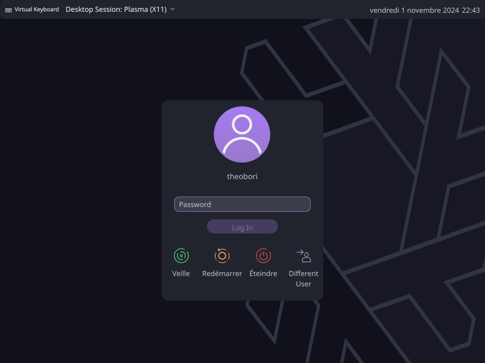
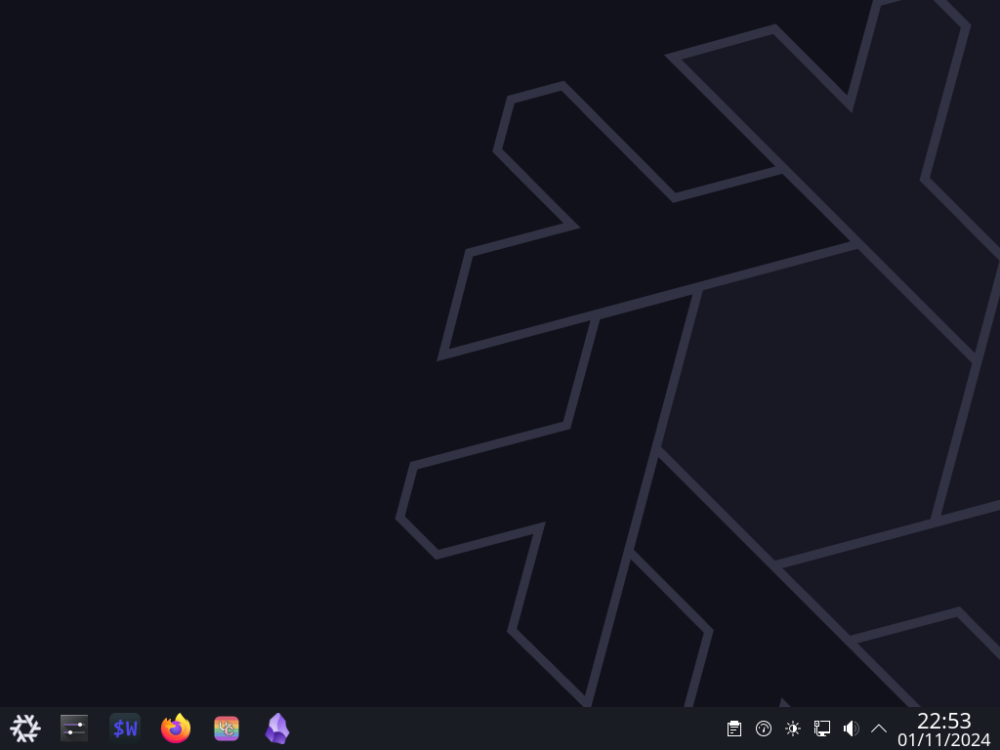
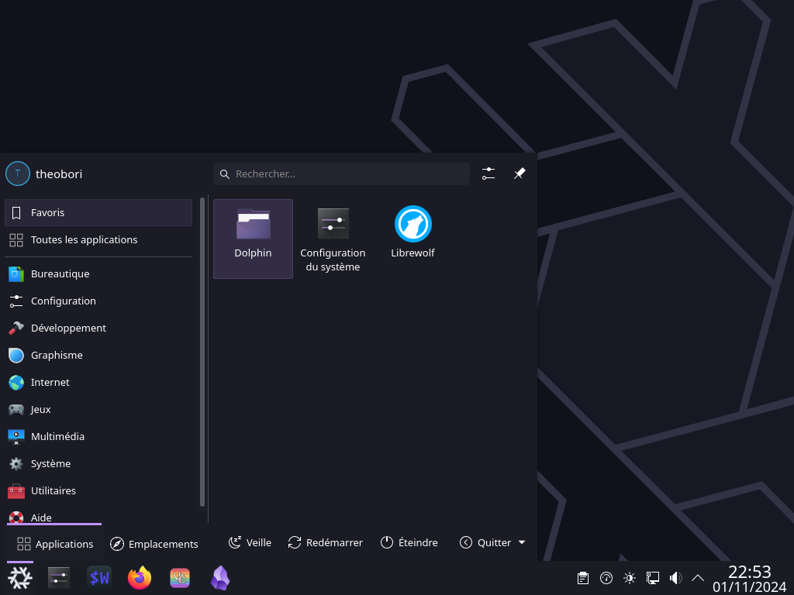
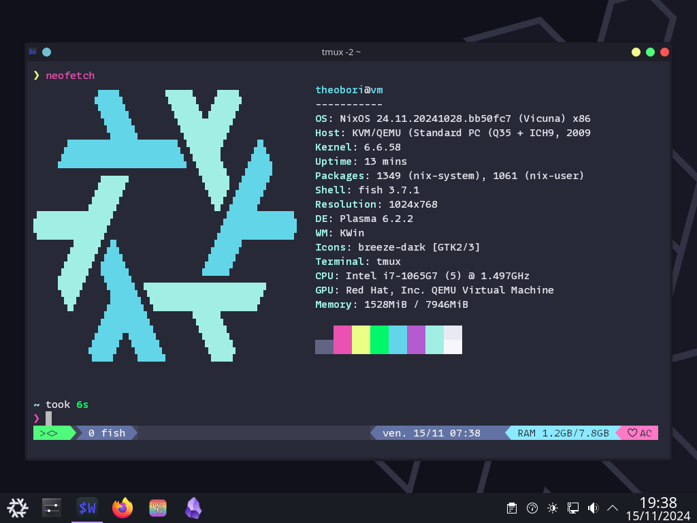

# ❄️ My NixOS Configuration

[](https://github.com/theobori/nixos-configuration/actions/workflows/check.yml) [](https://github.com/theobori/nixos-configuration/actions/workflows/pages.yml)

[](https://builtwithnix.org)

This repository contains all the Nix declarations I use to build my systems.

## Table of Contents

1. [Getting Started](#getting-started)
2. [Features](#features)
3. [Customization](#customization)
4. [Resources](#resources)

## Getting Started

Before diving in, ensure that you have Nix installed on your system. If not, you
can download and install it from the official
[Nix website](https://nixos.org/download.html) or from the
[Determinate Systems installer](https://github.com/DeterminateSystems/nix-installer).

### Clone this repository to your local machine

```bash
git clone https://github.com/theobori/nixos-configuration.git
cd nixos-configuration

# linux
sudo nixos-rebuild switch --flake .

 # with direnv
flake switch
```

### Deploy on a remote machine

Feel free to use my minimal bootable disk image [x86_64-install-iso/minimal](/systems/x86_64-install-iso/minimal/default.nix). The aim is to load this bootable iso on a target machine to have a usable OpenSSH server to deploy our NixOS configuration.

You can build it with the following command. 

```bash
nix build .#install-isoConfigurations.minimal
```

Once built, you'll find an iso file in the `iso` folder of the build result. Below, part of the result of the `tree result` command shows us that we have built an image for a `x86_64-linux` system.

```bash
result/
├── iso
│   └── nixos-24.11.20241028.bb50fc7-x86_64-linux.iso
...
```

Once loaded on the target machine, you can use a deployment tool such as [nixos-anywhere](https://numtide.com/projects/nixos-anywhere/) to deploy NixOS over SSH. 

Here's an example.

```bash
nix run github:nix-community/nixos-anywhere -- --generate-hardware-config nixos-generate-config systems/x86_64-linux/vm/hardware-configuration.nix nixos@<destination> --flake .#<system-name>
```

## Features

Here's an overview of what my Nix configuration offers:

- **External Dependency Integrations**:
  - Access the Nix User Repository (NUR) for additional packages and
    enhancements.

- **Home Manager**: Manage your dotfiles, home environment, and user-specific
  configurations with [Home Manager](https://github.com/nix-community/home-manager).

- **DevShell Support**: The flake provides a development shell (`devShell`) to
  support maintaining this flake. You can use the devShell for convenient
  development and maintenance of your Nix environment.

- **CI with Cachix**: The configuration includes continuous integration (CI)
  that pushes built artifacts to [Cachix](https://github.com/cachix/cachix). This ensures efficient builds and
  reduces the need to build dependencies on your local machine.

- **Utilize sops-nix**: Secret management with [sops-nix](https://github.com/Mic92/sops-nix) for secure and encrypted
  handling of sensitive information.

- **Theming with stylix**: Management of system and application colorscheme,
  fonts and wallpaper with [stylix](https://stylix.danth.me).

- **Declarative disk partitioning**: Use [disko](https://github.com/nix-community/disko) to declare your disk and format it
  using the Nix language.

- **Declarative Vencord configuration**: Use [nixcord](https://github.com/KaylorBen/nixcord) to declare your
  Vencord settings and plugins.

- **Declarative KDE Plasma configuration**: Use [plasma-manager](https://github.com/nix-community/plasma-manager) to declare your
  Vencord settings and plugins.

- **Declarative Flatpak installation**: Use [declarative-flatpak](https://github.com/GermanBread/declarative-flatpak) to manage
  KDE Plasma with Home Manager.

- **Declarative Spotify customization**: Use [spicetify-nix](https://github.com/Gerg-L/spicetify-nix) to modify Spotify.


## Customization

My Nix configuration, based on the [SnowfallOrg lib](https://github.com/snowfallorg/lib) structure, provides a
flexible and organized approach to managing your Nix environment. Here's how it
works:

- **Custom Library**: An optional custom library in the `lib/` directory
  contains a Nix function called with `inputs`, `snowfall-inputs`, and `lib`.
  The function should return an attribute set to merge with `lib`.

- **Modular Directory Structure**: You can create any (nestable) directory
  structure within `lib/`, `packages/`, `modules/`, `overlays/`, `systems/`, and
  `homes/`. Each directory should contain a Nix function that returns an
  attribute set to merge with the corresponding section.

- **Package Overlays**: The `packages/` directory includes an optional set of
  packages to export. Each package is instantiated with `callPackage`, and the
  files should contain functions that take an attribute set of packages and the
  required `lib` to return a derivation.

- **Modules for Configuration**: In the `modules/` directory, you can define
  NixOS modules for various platforms, such as `nixos`, `darwin`, and `home`.
  This modular approach simplifies system configuration management.

- **Custom Overlays**: The `overlays/` directory is for optional custom
  overlays. Each overlay file should contain a function that takes three
  arguments: an attribute set of your flake's inputs and a `channels` attribute
  containing all available channels, the final set of `pkgs`, and the previous
  set of `pkgs`. This allows you to customize package sets effectively.

- **System Configurations**: The `systems/` directory organizes system
  configurations based on architecture and format. You can create configurations
  for different architectures and formats, such as `x86_64-linux`,
  `aarch64-darwin`, and more.

- **Home Configurations**: Similar to system configurations, the `homes/`
  directory organizes home configurations based on architecture and format. This
  is especially useful if you want to manage home environments with Nix.

This structured approach to Nix configuration makes it easier to manage and
customize your Nix environment while maintaining flexibility and modularity.

## Screenshots

My NixOS KDE Plasma 6 environment looks like this.






## Resources

Other configurations from where I learned and copied:

- [hmajid2301/nixicle](https://gitlab.com/hmajid2301/nixicle)
- [khaneliman/khanelinix](https://github.com/khaneliman/khanelinix)
- [JakeHamilton/config](https://github.com/jakehamilton/config)

