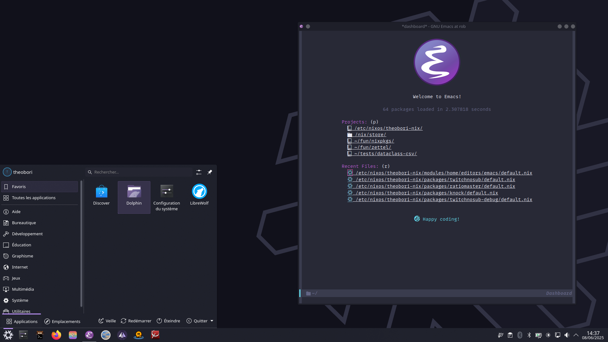

# My NixOS Configuration

[](https://github.com/theobori/nixos-configuration/actions/workflows/check.yml) [](https://github.com/theobori/nixos-configuration/actions/workflows/pages.yml)

[](https://builtwithnix.org)

This GitHub repository contains all the Nix declarations I use to build my systems. It is a [Nix Flake](https://wiki.nixos.org/wiki/Flakes) based on [Snowfall Lib](https://snowfall.org/guides/lib/quickstart).

## Getting Started

Before diving in, ensure that you have Nix installed on your system. If not, you
can download and install it from the official
[Nix website](https://nixos.org/download.html) or from the
[Determinate Systems installer](https://github.com/DeterminateSystems/nix-installer).

### Clone this repository to your local machine

You can clone the git repository then build and use the system with the following command lines.

```bash
git clone https://github.com/theobori/nixos-configuration.git
cd nixos-configuration

# linux
sudo nixos-rebuild switch --flake .

 # with direnv
flake switch
```

If you want to create disk partitions with disko then install my NixOS configuration in the mounted filesystem, you can run the following command lines.

```bash
# Create partitions with disko (make backup before if needed)
# Also don't forget to change the device value in the disko configuration if needed
sudo nix \
    --experimental-features "nix-command flakes" \
    run github:nix-community/disko -- \
    --mode disko \
    systems/x86_64-linux/rob/disk-config.nix # example filepath

# Install NixOS
sudo nixos-install --root /mnt --flake '/mnt/etc/nixos#nixos'
```

### Deploy on a remote machine

Feel free to use my minimal bootable disk image [x86_64-install-iso/minimal](/systems/x86_64-install-iso/minimal/default.nix). The aim is to load this bootable iso on a target machine to have a usable OpenSSH server to deploy our NixOS configuration.

You can build it with the following command.

```bash
nix build .#install-isoConfigurations.minimal
```

Once built, you'll find an iso file in the `iso` folder of the build result. Below, part of the result of the `tree result` command shows us that we have built an image for a `x86_64-linux` system.

```bash
result/
├── iso
│   └── nixos-24.11.20241028.bb50fc7-x86_64-linux.iso
...
```

Once loaded on the target machine, you can use a deployment tool such as [nixos-anywhere](https://numtide.com/projects/nixos-anywhere/) to deploy NixOS over SSH.

Here's an example.

```bash
nix run github:nix-community/nixos-anywhere -- --generate-hardware-config nixos-generate-config systems/x86_64-linux/vm/hardware-configuration.nix nixos@<destination> --flake .#<system-name>
```
## Screenshots

My NixOS KDE Plasma 6 environment looks like this.




## Resources

Other configurations from where I learned and copied:

- [hmajid2301/nixicle](https://gitlab.com/hmajid2301/nixicle)
- [khaneliman/khanelinix](https://github.com/khaneliman/khanelinix)
- [JakeHamilton/config](https://github.com/jakehamilton/config)
